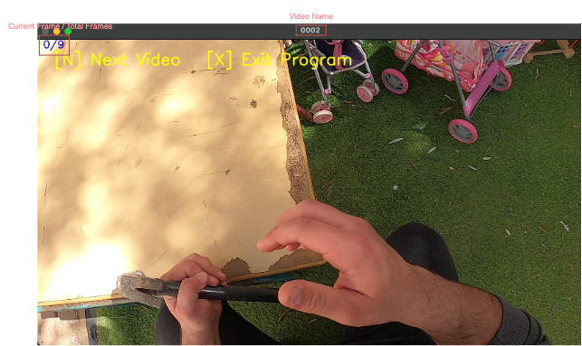
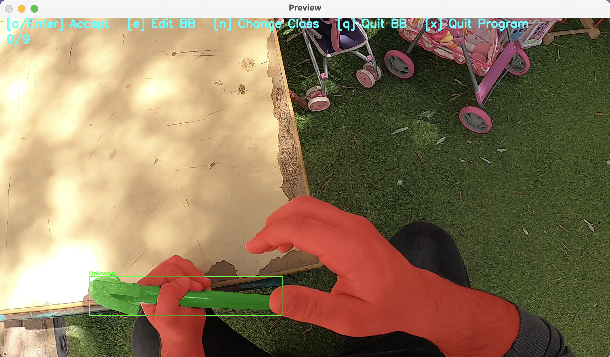
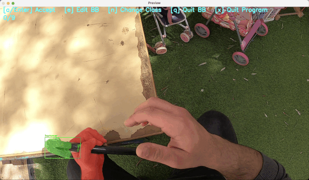
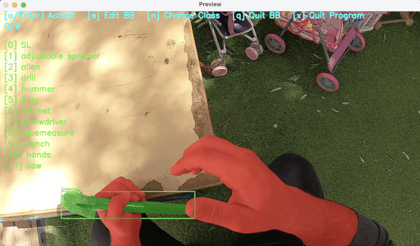

# Annotation Scheme for Object Detection & Segmentation Tasks

This repo contains the semi-automatic video annotation pipeline used in our [Maintenance Datasets] paper.


[](https://arxiv.org/abs/xxx)
[]([https://github.com/YourOrg/Annotation-Scheme](https://github.com/AI-Computer-Vision-BGU/MMTL))
[](https://youtu.be/your-video)


## Installation


#### 1&nbsp;·&nbsp; First, clone the repo with its submodules
```bash
git clone --recursive https://github.com/AI-Computer-Vision-BGU/Annotation-Scheme.git
cd Annotation-Scheme
pip install -r requirements.txt

```

#### 2&nbsp;·&nbsp; if you have CUDA installed, run the following (choose your version):
```bash
pip install torch torchvision torchaudio --index-url https://download.pytorch.org/whl/cu121
```

#### 3&nbsp;·&nbsp; Then, install SAM requirements. More Info [Here](https://github.com/facebookresearch/sam2/blob/main/INSTALL.md)
```bash
cd segmentanything && \
pip install -e . && \
cd checkpoints && \ 
./download_ckpts.sh   && \
cd ..
```


## Getting Started
To run the script:
```bash
python AnnotationScheme/annotation_scheme.py --new_shape (680, 340) --weights t
```
you can choose any weights for SAM2 [tiny (t), small (s), base_plus (b), large (l)]
This launches an **interactive wizard** that lets you choose **one of three workflows**:

#### 1&nbsp;·&nbsp;Annotate a *single* video  
* **Input** any `.mp4 / .mov` file  

#### 2&nbsp;·&nbsp;Annotate an *entire directory* of class-organised videos
* Input (root path)
<pre> root/
  │ 
  ├── object1/ 
  │ ├── clip_001.mp4 
  │ └── … 
  └── object2/ 
  └── … 
</pre>

The **Output** of both flows as follow
   <pre>
    res/
    ├── Images                # Contains the images
    │ ├── I1.jpg
    │ └── … 
    └── Annotations.json      # Contains the annotation.json fuck you   (COCO format)

  </pre>

  ---
## Interactive GUI

### 1 · Initial decision screen  
The very first pop-up lets you bail out early:

| Key | Action |
|-----|--------|
| **N** | Skip this video and move to the next one in the folder |
| **X** | Exit the entire program |

<p align="center">
  
</p>

---

### 2 · Annotator GUI  
Press **any other key** (Space / Enter) to jump into the annotator loop.
| Key | Action |
|-----|--------|
| **1** | annotate the **object**   |
| **2** | annotate the **hands**  |
| **b** | toggle between **Bounding-box** mode and **Point-prompt** mode  |
| **any other key**  | SAM2 starts with these prompts to propagate over the next **50 frames**  |

<p align="center">
  
</p>

---

### 3 · Preview & validation  
After that, the scheme replays all the annotated fframes so you can accept or refine:

| Key | Action |
|-----|--------|
| **e** | Edit BB / points on the current frame |
| **n** | Change the class label |
| **q** | Quit current video (saves progress) |
| **x** | Exit the program (saves progress) |

<p align="center">
  
</p>

<p align="center">
  
  
</p>

The loop repeats until the last frame is processed.
Accepted annotations are written to **JSON** file and their corresponding images under results/ folder (edittable).

---


## Stat
```bash
TODO
```

## Citations
```bash
TODO  
```

